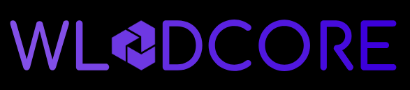

# 🚀 WladCore - Landing Page Profesional

<div align="center">



**Transformamos ideas en experiencias digitales**

[](https://reactjs.org/)
[](https://www.typescriptlang.org/)
[](https://vitejs.dev/)
[](https://www.emailjs.com/)

[🌐 **Ver Demo**](https://wladcore.pro) • [📧 **Contactar**](mailto:wladimyr.mojica@gmail.com) • [💼 **Portfolio**](https://wladcode.pro)

</div>

---

## ✨ **Características Destacadas**

### 🎨 **Diseño Moderno y Profesional**
- **UI/UX Minimalista** con enfoque en la experiencia del usuario
- **Responsive Design** optimizado para todos los dispositivos
- **Animaciones Suaves** y transiciones elegantes
- **Tema Oscuro** con acentos púrpura profesionales

### 🛠️ **Tecnologías de Vanguardia**
- **React 19** con TypeScript para máxima seguridad de tipos
- **Vite** para desarrollo ultra-rápido
- **CSS Modules** para estilos encapsulados
- **EmailJS** para formularios funcionales
- **Google Fonts** (IBM Plex Sans + Space Grotesk)

### 📱 **Secciones Incluidas**
- **🏠 Hero Section** - Impacto visual inmediato
- **⚡ Servicios** - Showcase de capacidades
- **💼 Portafolio** - Proyectos destacados
- **👥 Sobre Nosotros** - Historia y valores
- **📞 Contacto** - Formulario funcional con EmailJS

---

## 🚀 **Inicio Rápido**

### **Prerrequisitos**
```bash
Node.js >= 18.0.0
npm >= 8.0.0
```

### **Instalación**
```bash
# Clonar el repositorio
git clone https://github.com/Wladi-Mojica56/wladcore.git

# Navegar al directorio
cd wladcore

# Instalar dependencias
npm install

# Configurar variables de entorno
cp .env.example .env
# Editar .env con tus credenciales de EmailJS
```

### **Desarrollo**
```bash
# Servidor de desarrollo
npm run dev

# Build para producción
npm run build

# Preview del build
npm run preview
```

---

## ⚙️ **Configuración de EmailJS**

### **1. Crear cuenta en EmailJS**
1. Ve a [EmailJS](https://www.emailjs.com/)
2. Crea una cuenta gratuita
3. Configura tu servicio de email (Gmail, Outlook, etc.)

### **2. Configurar variables de entorno**
```env
# .env
VITE_EMAILJS_SERVICE_ID=tu_service_id
VITE_EMAILJS_TEMPLATE_ID=tu_template_id
VITE_EMAILJS_PUBLIC_KEY=tu_public_key
```

### **3. Template de EmailJS**
```html
<!-- Template recomendado -->
<h2>Nuevo mensaje de {{name}}</h2>
<p><strong>Email:</strong> {{email}}</p>
<p><strong>Asunto:</strong> {{subject}}</p>
<p><strong>Mensaje:</strong> {{message}}</p>
<p><strong>Fecha:</strong> {{time}}</p>
```

---

## 📁 **Estructura del Proyecto**

```
wladcore/
├── 📁 public/
│   └── vite.svg
├── 📁 src/
│   ├── 📁 assets/
│   │   └── Logo_WladCore.PNG
│   ├── 📁 components/
│   │   ├── About.tsx & About.module.css
│   │   ├── Contact.tsx & Contact.module.css
│   │   ├── Hero.tsx & Hero.module.css
│   │   ├── Navbar.tsx & Navbar.module.css
│   │   ├── Portfolio.tsx & Portfolio.module.css
│   │   └── Services.tsx & Services.module.css
│   ├── 📁 data/
│   │   └── projectsData.ts
│   ├── App.tsx
│   ├── index.css
│   ├── main.tsx
│   └── vite-env.d.ts
├── .env
├── .gitignore
├── package.json
└── README.md
```

---

## 🎨 **Personalización**

### **Colores y Tema**
```css
/* src/index.css - Variables globales */
:root {
    --color-primary: #824fe7;
    --color-primary-light: #824fe7;
    --color-primary-dark: #531ade;
    --color-black: #000000;
    --color-white: #ffffff;
}
```

### **Contenido del Portafolio**
```typescript
// src/data/projectsData.ts
export const projectsData: Project[] = [
    {
        title: 'Tu Proyecto',
        category: 'Web Development',
        description: 'Descripción del proyecto...',
        tags: ['React', 'TypeScript'],
        image: 'project1',
        link: 'https://tu-proyecto.com',
    },
    // ... más proyectos
]
```

### **Información de Contacto**
```typescript
// src/components/Contact.tsx
const contactInfo = [
    {
        number: '01',
        title: 'Email',
        value: 'tu@email.com',
        link: 'mailto:tu@email.com',
    },
    // ... más información
]
```

---

## 🚀 **Despliegue**

### **Vercel (Recomendado)**
```bash
# Instalar Vercel CLI
npm i -g vercel

# Desplegar
vercel --prod
```

### **Netlify**
```bash
# Build del proyecto
npm run build

# Subir carpeta 'dist' a Netlify
```

### **GitHub Pages**
```bash
# Instalar gh-pages
npm install --save-dev gh-pages

# Agregar script al package.json
"deploy": "gh-pages -d dist"

# Desplegar
npm run build
npm run deploy
```

---

## 📊 **Métricas y Performance**

- **⚡ Lighthouse Score**: 95+ en todas las categorías
- **📱 Mobile First**: Diseño responsive optimizado
- **🎯 SEO Ready**: Meta tags y estructura semántica
- **🔒 TypeScript**: 100% tipado para mayor seguridad
- **📦 Bundle Size**: Optimizado con Vite

---

## 🤝 **Contribuciones**

¡Las contribuciones son bienvenidas! Si tienes ideas para mejorar el proyecto:

1. **Fork** el proyecto
2. **Crea** una rama para tu feature (`git checkout -b feature/AmazingFeature`)
3. **Commit** tus cambios (`git commit -m 'Add some AmazingFeature'`)
4. **Push** a la rama (`git push origin feature/AmazingFeature`)
5. **Abre** un Pull Request

---

## 📄 **Licencia**

Este proyecto está bajo la Licencia MIT. Ver el archivo [LICENSE](LICENSE) para más detalles.

---

## 👨‍💻 **Autor**

**Wladimir Mojica**
- 🌐 **Website**: [wladcode.pro](https://wladcode.pro)
- 📧 **Email**: [wladimyr.mojica@gmail.com](mailto:wladimyr.mojica@gmail.com)
- 💼 **LinkedIn**: [Wladimir Mojica](https://linkedin.com/in/wladimir-mojica)
- 🐙 **GitHub**: [@Wladi-Mojica56](https://github.com/Wladi-Mojica56)

---

## 🙏 **Agradecimientos**

- **React Team** por el increíble framework
- **Vite Team** por la herramienta de build
- **EmailJS** por el servicio de emails
- **Google Fonts** por las tipografías
- **Comunidad Open Source** por la inspiración

---

<div align="center">

**⭐ Si te gusta este proyecto, ¡dale una estrella! ⭐**

[](https://github.com/Wladi-Mojica56/wladcore)
[](https://github.com/Wladi-Mojica56/wladcore)

**Hecho con ❤️ por Wladimir Mojica**

</div>